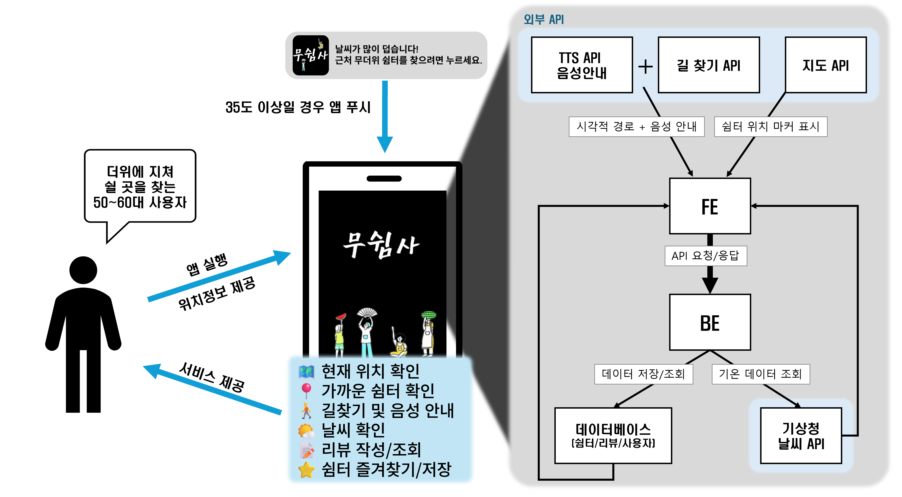

# [충남대 1팀 - 무쉼사: 무더위 쉼터를 찾는 사람들]

> - **app**: 안드로이드 앱 개발
> - **web**: React + Vite 웹 개발
> - **최종 형태**: 웹뷰(WebView) 기반의 하이브리드 앱

## 🌐 FE (Frontend) 설명

### 🔧 기술 스택

- **Framework**: React + Vite
- **Language**: TypeScript
- **Styling**: Emotion (CSS-in-JS)
- **State Management**: React Query / Context API
- **Build/Deploy**: Vite, GitHub Actions (CI/CD)

---

### 📂 전체 프로젝트 구조

```
Team19_FE/   # 루트 폴더
├── web/     # React 웹 앱
└── app/     # Android 앱 (이 폴더를 Android Studio에서 열기)
```

### Android 앱 구조 (app/ 폴더 내부)

```
app/
├── app/
│   ├── src/main/
│   │   ├── java/com/example/musuimsa/
│   │   │   └── MainActivity.kt          # 메인 액티비티
│   │   ├── res/                         # 리소스 파일들
│   │   └── AndroidManifest.xml          # 앱 매니페스트
│   ├── build.gradle.kts                 # 앱 레벨 빌드 설정
│   └── proguard-rules.pro               # ProGuard 규칙
├── build.gradle.kts                     # 프로젝트 레벨 빌드 설정
├── gradle.properties                    # Gradle 속성
└── settings.gradle.kts                  # 프로젝트 설정
```

### Web 구조 (Web/ 폴더 내부)

```
web/
└─ src/
├─ pages/ # 페이지 컴포넌트
├─ components/ # 재사용 가능한 UI 컴포넌트
├─ hooks/ # 커스텀 훅
├─ utils/ # 공통 유틸 함수 (ex. 날짜 포맷터)
├─ styles/ # 테마, 전역 스타일
└─ assets/ # 이미지, 아이콘, 폰트
```

---

### ✨ 주요 기능 (사용자)

- 📍 **현재 위치 확인**
- 🏠 **가까운 무더위 쉼터 확인**
- 🚶 **길찾기 및 음성 안내(TTS)**
- ☀️ **날씨 확인**
- 📝 **리뷰 작성/조회**
- ⭐ **쉼터 찜**

---

### 🔗 외부 API 연동

- **지도 API**: 쉼터 위치 지도 표시
- **길찾기 API**: 쉼터까지 경로 안내
- **TTS API**: 길찾기 경로 음성 안내
- **기상청 날씨 API**: 현재 기온/날씨 정보 제공

---

### 🏛️ FE 아키텍처 다이어그램



---

### ▶️ App 실행 방법

### 1. Android Studio에서 프로젝트 열기

⚠️ **중요**: 루트 폴더가 아닌 **app 폴더**를 열어야 합니다!

```bash
# Android Studio 실행 후
File → Open → Team19_FE/app 폴더 선택 (루트 폴더 X)
```

**이유**: 현재 프로젝트는 하이브리드 구조로 `web/`와 `app/` 폴더가 분리되어 있습니다. 루트 폴더를 열면 Android Studio가 Android 프로젝트임을 인식하지 못해 Run 버튼이 활성화되지 않습니다.

### 2. SDK 설정 확인

- Android Studio가 자동으로 `local.properties` 파일을 생성합니다
- SDK 경로가 올바르게 설정되었는지 확인하세요

### 3. 디바이스 연결

- **실제 디바이스**: USB 디버깅 활성화 후 연결
- **에뮬레이터**: AVD Manager에서 가상 디바이스 생성

### 4. 빌드 및 실행

```bash
# 터미널에서 실행
./gradlew assembleDebug

# 또는 Android Studio에서
Run → Run 'app'
```

### ▶️ Web 실행 방법

```
# web 폴더로 이동
cd web

# 설치
npm install

# 개발 서버 실행
npm run dev

# 빌드
npm run build
```
